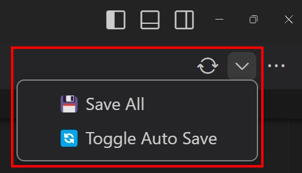
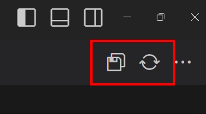
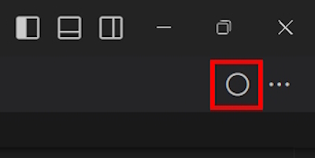

## Auto Save Toggler

### Description

`Auto Save Toggler` is a [VSCode extension](https://marketplace.visualstudio.com/items?itemName=BachiMjavanadze.auto-save-toggler) that enhances your workflow by providing quick access to save functions directly from your editor toolbar. This extension helps you manage your auto-save preferences with ease.

### Features

- **Save All Button**: Quickly save all open files with a single click.
- **Toggle Auto Save Button**: Easily switch auto-save on or off.
- **Kill All Tasks Button**: Kill all running terminal tasks from the status bar.
- **Toggle Terminal Button**: Show or hide the terminal panel from the status bar.
- **Multiple Display Variants**: Choose between different display options to suit your preferences.

#### Default Configurations:

```json
{
  "AutoSaveToggler.config": {
    "isActive": true,
    "variant": 2,
    "killAllTasks": true,
    "toggleTerminal": true
  }
}
```

### Configuration

- `isActive`: Set to `true` to enable the extension, `false` to disable.
- `variant`: Choose the display variant (1 for compact, 2 for expanded, 3 for single toggle button).
- `killAllTasks`: Set to `false` to hide the Kill All Tasks button in the status bar.
- `toggleTerminal`: Set to `false` to hide the Toggle Terminal button in the status bar.

### Usage

After installation, you'll see new buttons in your editor title bar. The appearance depends on your chosen variant:

1. **Variant 1 (Compact)**: A single dynamic button with a dropdown menu.



<br>

2. **Variant 2 (Expanded)**: Two separate buttons for `Save All` and `Toggle Auto Save`. `Save All` button is hidden when `Auto Save` is enabled.



<br>

3. **Variant 3 (Single Toggle)**: A single button to toggle Auto Save on/off with changing icons.



### License

This extension is licensed under the [MIT License](https://github.com/BachiMjavanadze/auto-save-toggler/blob/main/LICENSE.md).
