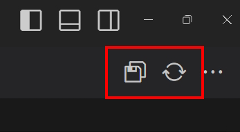

## Auto Save Toggler

### Description

`Auto Save Toggler` is a [VSCode extension](https://marketplace.visualstudio.com/items?itemName=BachiMjavanadze.auto-save-toggler) that enhances your workflow by providing quick access to save functions directly from your editor toolbar. This extension helps you manage your auto-save preferences with ease.

### Features

- **Save All Button**: Quickly save all open files with a single click.
- **Toggle Auto Save Button**: Easily switch auto-save on or off.
- **Compact View Option**: Choose between displaying both buttons or a single dynamic button with a dropdown menu.

#### Default Configurations:

```json
{
  "AutoSaveToggler.config": {
    "isActive": true,
    "compactView": true
  }
}
```

### Usage

After installation, you'll see new buttons in your editor title bar:


If you've enabled the compact view in settings, you'll see a dropdown menu to access both functions:



### License

This extension is licensed under the [MIT License](LICENSE).
